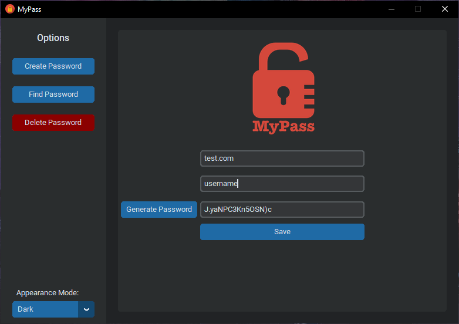
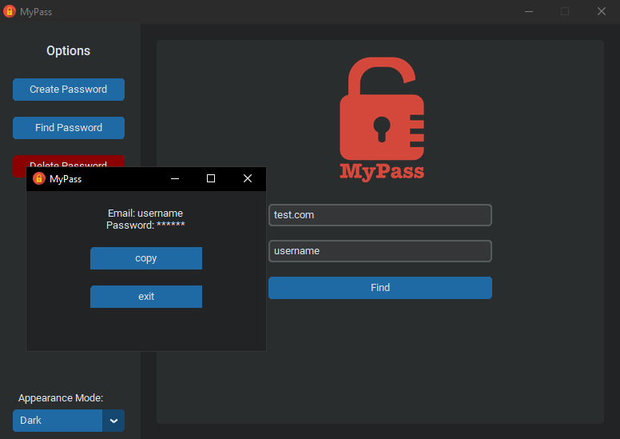
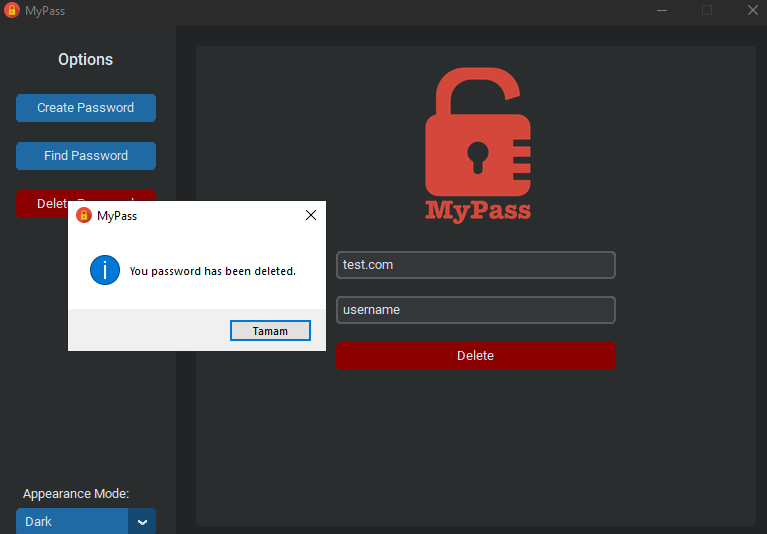

# python-password-manager
Python password manager written with <a href="https://github.com/TomSchimansky/CustomTkinter">customtkinter</a> and <a href="https://github.com/jaraco/keyring">keyring</a>

<h2>Create and Save Passwords</h2>
Enter website/service name and email/username
click generate password then save

<h2>Find Saved Passwords</h2>
Use your service and username to get saved passwords.

<h2>Delete Passwords</h2>
Again use your saved service and username to delete a password.

On windows all information are saved to Credential Manager.
Not tested on Linux/Mac.
